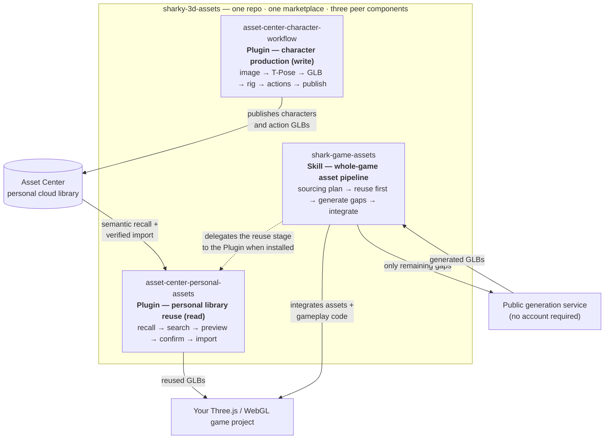

<div align="center">
  <h1>Your AI 3D Game Asset Assistant</h1>
  <p>Generate, animate, reuse, and integrate production-ready GLB assets without leaving your coding workflow.</p>
  <p>
    <a href="https://studio.13-216-49-19.sslip.io/asset-center/"></a>
    
    
  </p>
  <h3>Install with one prompt</h3>
  <p> Codex and Claude Code installation prompt.</p>
</div>

<div align="center">


```text
/goal Read https://raw.githubusercontent.com/Alterverse-tech/sharky-3d-assets/main/INSTALL.md to install the Shark Game Assets Skill and Asset Center Plugins, then set up a new task for me.
```


> **Generate production-ready 3D game assets without leaving your coding workflow.**

`shark-game-assets` is an agent skill for generating game-ready `.glb` assets while building Three.js and WebGL games.


> **claude code,confirm and use your exists model or create new one**


> **codex,confirm and use your exists model or create new one**


```
Describe your game
        ↓
Agent matches reusable assets and prepares the sourcing plan
        ↓
You confirm: selected GLBs are reused and only gaps are generated
        ↓
Agent integrates everything into a playable Three.js/WebGL game
```

## Highlights

- **Agent-native workflow** — generate assets directly from Codex, Claude Code, or other skill-compatible coding agents
- **Game-ready GLB output** — designed for Three.js, WebGL, and browser-based games
- **Multiple asset categories** — players, enemies, NPCs, collectibles, props, and environmental objects
- **Rigged characters with confirmed action sets** — walk by default; climb, run_upstairs, hurt, and 100+ catalog presets behind a user-confirmed action plan
- **Remote generation service** — no local GPU or 3D generation environment required
- **Code and assets together** — let your agent build gameplay while producing the required models
- **Rapid prototyping** — move from a game idea to a playable 3D experience faster

## What's New (2026-08)

**Reuse before generate.** When the Asset Center personal-assets Plugin is installed, the agent first inspects current-project imports, reads the personal catalog once, and opens a complete ten-column asset confirmation table. Every model/action requirement expands into A/B/C-style single-choice rows with candidate, model source, action, triggering scene, action source, reuse state, and current selection. Real reusable names open their HTTP preview pages. One final confirmation freezes the plan; only selected Asset Center files are imported and only remaining gaps are sent to generation. Reused and generated GLBs then share the same `/regeneration.html` progress view.

**Fresh confirmation per game intent.** Historical asset plans are selection snapshots, not current-task authorization. The agent first decides whether history is the active same task, related history, unrelated history, or uncertain. Related history may prefill a newly rendered board; unrelated or uncertain history is ignored, and only a live confirmation in the active asset task unlocks import or generation.

**Session-current Plugin updates.** The Asset Center Plugin checks this Git marketplace once whenever its MCP process starts. If a newer Plugin version exists, that same agent session launches the newer MCP server; network or update failures fall back to the installed copy.

**Action requirements confirmation gate.** Before generating any character or creature, the agent reads your game description or script, extracts the actions each entity actually needs, and presents an action requirements table — character/entity, action, triggering scene, suggested source, Tripo preset, and cost. Nothing is generated and no credits are spent until you explicitly confirm; add, remove, or swap rows and the table re-renders. The confirmed list is frozen as the run's action plan.


**Full Tripo action catalog.** Characters are no longer limited to a walk clip. The bundled catalog (`scripts/preset-catalog.json`) opens the full Tripo retarget preset library: `climb`, `run_upstairs`, `hurt`, `jump`, combat, dance, and 100+ more on the v1.0 biped rig, plus per-rig-type locomotion presets on v2.5 (quadruped, aquatic, serpentine, and others). The default stays walk-only; extra actions are opt-in through the confirmed plan.


**Live progress markdown with GLB links and gap review.** During generation the confirmed table is mirrored to `animation-plan-progress.md` and atomically overwritten as work lands — open it in any editor to watch progress:

- per-row live status: ⬜ pending / 🔄 running % / ✅ done / ❌ failed
- per-row GLB download link (clickable when the local server origin is passed via `--base-url`) and `public/` local path the moment each file lands
- a closing plan-vs-actual gap review listing every row that has not landed, with failure reasons — when the run finishes it doubles as the completion report


## Components and boundaries

This repository hosts three peer components behind one marketplace (`sharky-3d-assets`). Each lives in its own directory, is versioned independently, and can be installed or updated on its own:

| Component | Type | Owns | Stays out of | Auth |
|---|---|---|---|---|
| `shark-game-assets` | Skill | Whole-game asset orchestration: action-plan confirmation, reuse-before-generate sourcing, gap generation through the public service, game integration and publishing | Personal library contents; character production stages | None (public service) |
| `asset-center-personal-assets` | Plugin (MCP) | The read side of your personal Asset Center library: semantic recall, search, preview, confirmed selection, verified local import | Generating new assets; writing to the library | Asset Center OAuth / service token |
| `asset-center-character-workflow` | Plugin (MCP) | The write side of character production: reference image → T-Pose → GLB → rig check → actions → publish into your Asset Center library, shared live with the browser Workbench | Game integration; non-character assets; creature rigs (bipeds only) | Asset Center OAuth / service token |

They connect through your Asset Center library and your game project, not through each other's internals:



In short: the character-workflow Plugin **produces** characters into your library, the personal-assets Plugin **reuses** the library inside game projects, and the Skill **orchestrates** the whole game's asset pipeline — reuse first, generate only what is missing. Any one of the three works without the other two; together they close the produce → reuse → integrate loop.

## Installation

### Install with one prompt in Codex or Claude Code

Paste this into any Codex task or Claude Code session:

```text
Read https://raw.githubusercontent.com/Alterverse-tech/sharky-3d-assets/main/INSTALL.md and install Shark Game Assets for me.
```

The agent checks what is already installed, adds only the missing Skill or Plugin components (including the character-workflow Plugin), verifies each result separately, and asks you to start a new task.

### Manual installation

Install the skill globally using the [Skills CLI](https://skills.sh):

```
npx skills add https://github.com/Alterverse-tech/sharky-3d-assets \
  --skill shark-game-assets \
  -g
```

After installation, the skill becomes available to compatible coding agents on your machine.

Claude Code can install the skill from the plugin marketplace instead of the Skills CLI (pick one mechanism, not both):

```bash
claude plugin marketplace add Alterverse-tech/sharky-3d-assets
claude plugin install shark-game-assets@sharky-3d-assets
```

To add the Asset Center Plugin to Codex:

```bash
codex plugin marketplace add Alterverse-tech/sharky-3d-assets --ref main
codex plugin add asset-center-personal-assets@sharky-3d-assets
```

To add the Asset Center Plugin to Claude Code:

```bash
claude plugin marketplace add Alterverse-tech/sharky-3d-assets
claude plugin install asset-center-personal-assets@sharky-3d-assets
```

### Character Workflow Plugin (standalone)

`asset-center-character-workflow` turns a discussed or attached human reference into a production character — T-Pose, GLB, rig check, action retargeting, and publishing — in the same owner-scoped workflow as the browser-hosted Character Workbench. It installs on its own; neither the Skill nor the personal-assets Plugin is required.

To add it to Codex:

```bash
codex plugin marketplace add Alterverse-tech/sharky-3d-assets --ref main
codex plugin add asset-center-character-workflow@sharky-3d-assets
```

To add it to Claude Code:

```bash
claude plugin marketplace add Alterverse-tech/sharky-3d-assets
claude plugin install asset-center-character-workflow@sharky-3d-assets
```

If a marketplace `add` says `sharky-3d-assets` already exists, skip that line and run only the plugin install. Earlier installations from the retired `asset-center-local` marketplace keep working; to migrate, remove that plugin and marketplace with the same CLI, then install `asset-center-character-workflow@sharky-3d-assets`. See [plugins/asset-center-character-workflow/README.md](plugins/asset-center-character-workflow/README.md) for the full workflow description.

Set `ASSET_CENTER_SERVICE_TOKEN` in the environment that launches Codex or Claude Code. The Plugin is independent, but when `shark-game-assets` reaches its reuse-before-generation sourcing stage, the personal-assets tools and native selection board become the default reuse path.

Existing users who installed only the Skill receive a one-time Plugin recommendation when a game first reaches asset sourcing. Installation is never silent: the agent waits for confirmation, runs only missing commands, and asks the user to start a new thread before using the newly installed tools.

When no suitable character or linked action is available, choose **[设计人物资产](https://studio.13-216-49-19.sslip.io/asset-center/characters/new)**. After publishing the character and its action GLBs, later game tasks can recommend the reusable static model together with its linked actions.

## Public Access

Shark Game Assets uses a public remote asset-generation service. Users can generate assets from Codex, Claude Code, other compatible clients, or direct CLI installs without creating an account or configuring a token.

The client uses `https://studio.13-216-49-19.sslip.io` by default. Set `GAME_ASSETS_API_URL` only when overriding that service. Tripo and Gemini provider credentials remain on the service and are never distributed with the skill.

## Usage

Once installed, ask your coding agent to generate the assets required by your game.

For example:

```
Create a low-poly third-person survival game in Three.js.

Use shark-game-assets to generate:

- A stylized male survivor character
- Three mutant enemy variants
- A medical supply crate
- A collectible energy crystal
- A damaged sci-fi storage container

Generate the models as game-ready GLB assets and integrate them into the game.
```

For characters with animations, describe the plot beats that trigger each action — the agent proposes the action table for you to confirm before anything is generated:

```
Use shark-game-assets for a lighthouse keeper game in Three.js.

Story: the keeper patrols the ground floor at night; when the storm alarm
rings, he must rush up the spiral staircase to light the beacon in time.
```

The agent responds with an action requirements table (keeper: walk for the patrol, run_upstairs for the staircase dash, procedural idle) and waits for your confirmation before spending any generation credits.

You can also request an individual asset:

```
Use shark-game-assets to generate a low-poly sci-fi treasure chest.

Requirements:

- Game-ready GLB
- Separate lid and base
- Metallic PBR material
- Optimized for a browser game
- Approximately one meter wide
```

## Supported Asset Types

### Characters

- Player characters
- Enemies
- NPCs
- Creatures
- Bosses

### Gameplay Objects

- Collectibles
- Weapons
- Tools
- Keys
- Chests
- Interactive props

### Environment Assets

- Furniture
- Rocks
- Trees
- Containers
- Machines
- Architectural props
- Decorative objects

## Recommended Prompt Structure

Clear asset specifications produce more consistent results.

```
Asset type:
Visual style:
Shape and proportions:
Materials:
Required parts:
Target scale:
Polygon budget:
Animation requirements:
Game engine:
Output format:
```

Example:

```
Asset type: Enemy character
Visual style: Stylized low-poly sci-fi
Shape and proportions: Tall humanoid with long arms
Materials: Dark organic armor with emissive details
Required parts: Full body, separate eyes, clean silhouette
Target scale: 2.2 meters tall
Polygon budget: Optimized for a browser game
Animation requirements: T-pose, suitable for humanoid rigging
Game engine: Three.js
Output format: GLB
```

## Get Access

Shark Game Assets is powered by a remote asset-generation service.

No account or API token is required for asset generation.

## License

Free for non-commercial use. Commercial use requires prior written permission.

---

<p align="center"> <strong>Build the game. Generate the world.</strong> </p>
