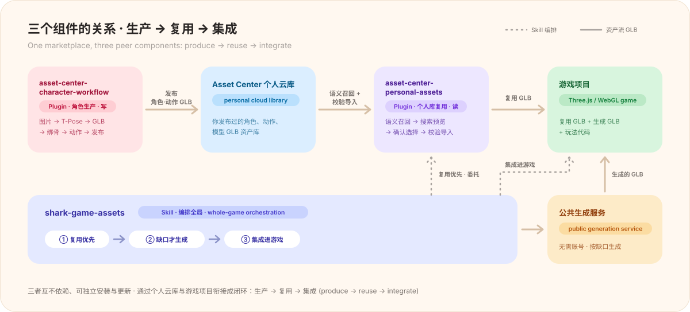
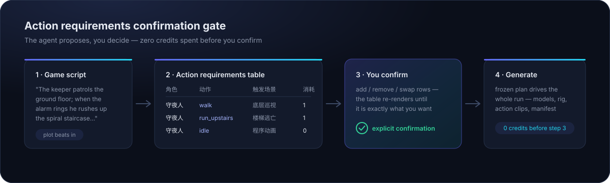
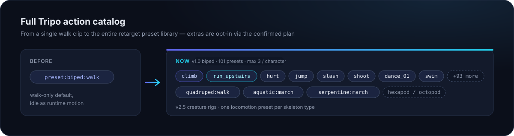
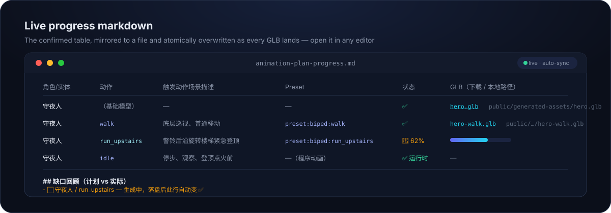
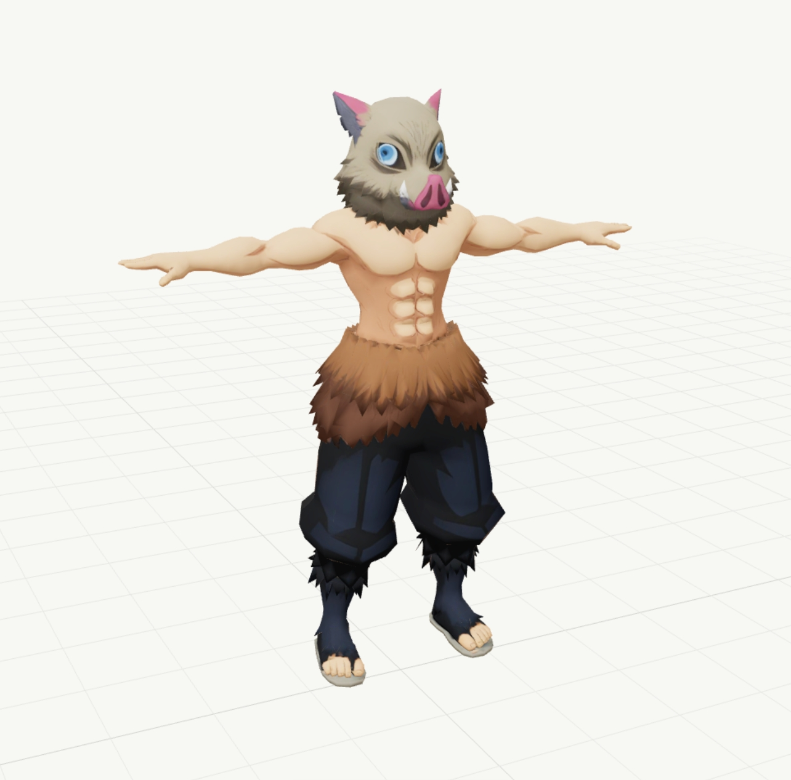
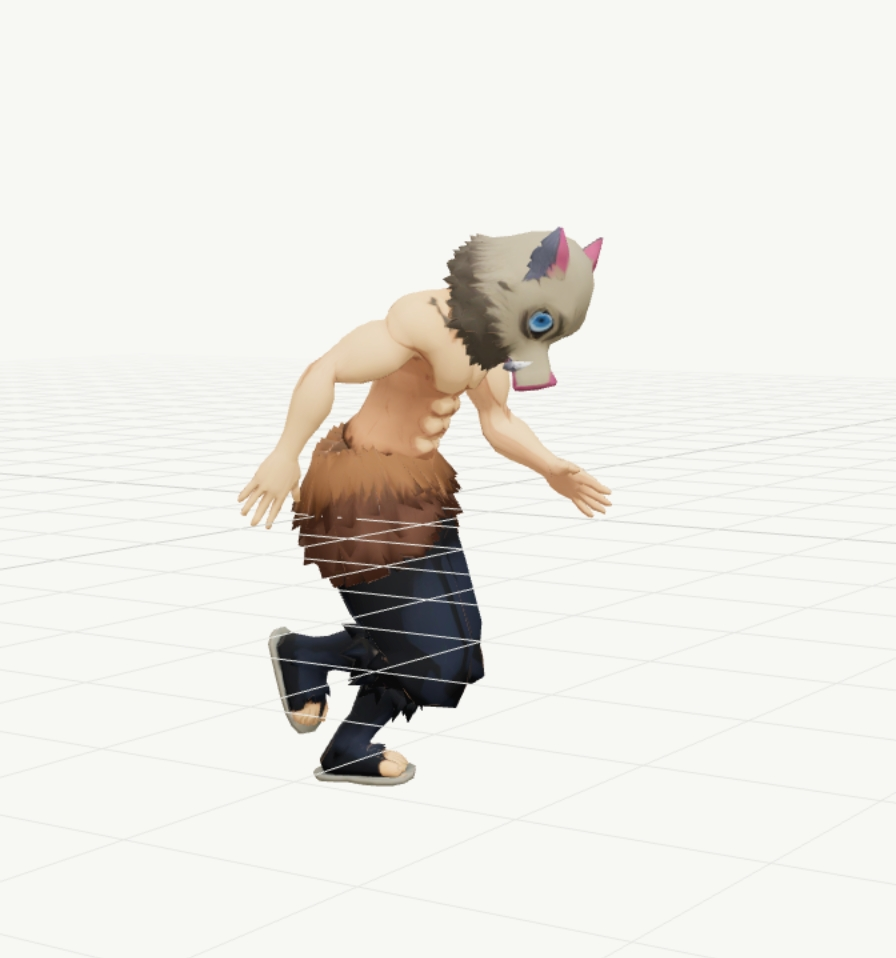
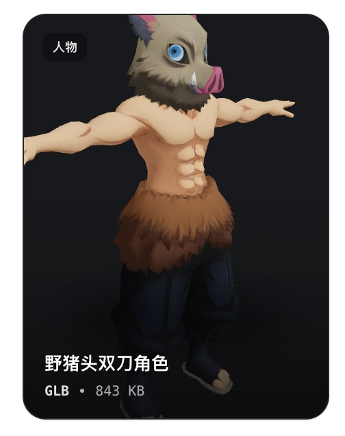

<div align="center">
  <h1>Your AI 3D Game Asset Assistant</h1>
  <p>Generate, animate, reuse, and integrate production-ready GLB assets without leaving your coding workflow.</p>
  <p>
    <a href="https://studio.13-216-49-19.sslip.io/asset-center/"></a>
    
    
  </p>
  <h3>Install with one prompt</h3>
  <p>Paste into any Codex task or Claude Code session — it checks what is installed, adds only what is missing, verifies each component, then asks you to start a new task.</p>
</div>

```text
/goal Read https://raw.githubusercontent.com/Alterverse-tech/sharky-3d-assets/main/INSTALL.md to install the Shark Game Assets Skill, Asset Center Personal Assets Plugin, and Asset Center Character Workflow Plugin, then set up a new task for me.
```

## Components and boundaries

One repo, one marketplace (`sharky-3d-assets`), three peer components — each installs and updates on its own:



| Component | Type | Owns | Auth |
|---|---|---|---|
| `shark-game-assets` | Skill | Whole-game asset pipeline: action-plan confirmation, reuse-before-generate sourcing, gap generation, game integration | None (public service) |
| `asset-center-personal-assets` | Plugin (MCP) | Read side of your personal library: semantic recall, search, preview, confirmed selection, verified import | Asset Center OAuth / service token |
| `asset-center-character-workflow` | Plugin (MCP) | Write side of character production: image → T-Pose → GLB → rig → actions → publish, shared live with the browser Workbench | Asset Center OAuth / service token |

The character-workflow Plugin **produces** characters into your library, the personal-assets Plugin **reuses** the library inside game projects, and the Skill **orchestrates** the whole game — reuse first, generate only what is missing.

## Highlights

- **Agent-native** — generate assets directly from Codex, Claude Code, or any skill-compatible coding agent; gameplay code and models land together
- **Game-ready GLB** — players, enemies, NPCs, collectibles, props, and environments for Three.js / WebGL games
- **Reuse before generate** — with the personal-assets Plugin installed, the agent recalls your library and opens a complete ten-column asset confirmation table; one confirmation freezes the plan, only selected files are imported, and only remaining gaps are generated
- **Confirmed action plans** — an action requirements table (entity, action, triggering scene, preset, cost) must be explicitly confirmed before any credits are spent; the full Tripo catalog (`climb`, `run_upstairs`, `hurt`, combat, dance, 100+ presets) is opt-in per plan
- **Remote generation service** — no local GPU, no account, no token for public generation

<details>
<summary><b>How a run looks</b> — confirmation gate, action catalog, live progress, host screens</summary>

<br>

**Action requirements confirmation gate.** The agent reads your game script, extracts the actions each entity needs, and waits for explicit confirmation — nothing is generated before you confirm.



**Full Tripo action catalog.** Beyond the default walk clip: 100+ biped presets on v1.0 plus per-rig-type locomotion on v2.5 (quadruped, aquatic, serpentine), from `scripts/preset-catalog.json`.



**Live progress markdown.** The confirmed table mirrors to `animation-plan-progress.md` with per-row status, GLB download links as files land, and a closing plan-vs-actual gap review.



**Confirm and reuse your existing models** — the same flow in Claude Code and Codex:


**Fresh confirmation per game intent.** Historical asset plans are snapshots, never current-task authorization: related history may prefill a newly rendered board, unrelated or uncertain history is ignored, and only a live confirmation unlocks import or generation.

**Session-current Plugin updates.** The Plugin checks this Git marketplace when its MCP process starts and launches the newer version in the same session; failures fall back silently to the installed copy.

</details>

## Installation

The one-prompt install at the top covers everything. To install manually, add the marketplace once and pick the components you need — any subset works:

**Codex**

```bash
codex plugin marketplace add Alterverse-tech/sharky-3d-assets --ref main
codex plugin add asset-center-personal-assets@sharky-3d-assets
codex plugin add asset-center-character-workflow@sharky-3d-assets
npx skills add https://github.com/Alterverse-tech/sharky-3d-assets --skill shark-game-assets -g
```

**Claude Code**

```bash
claude plugin marketplace add Alterverse-tech/sharky-3d-assets
claude plugin install shark-game-assets@sharky-3d-assets
claude plugin install asset-center-personal-assets@sharky-3d-assets
claude plugin install asset-center-character-workflow@sharky-3d-assets
```

Notes: the skills-CLI install (`npx skills add … -g`) serves Codex and Claude Code at once — if you use it, skip `shark-game-assets@sharky-3d-assets` (never install both variants). A marketplace `add` that says `sharky-3d-assets` already exists is fine — run only the installs. Migrating `asset-center-character-workflow` from the retired `asset-center-local` marketplace: remove that plugin and marketplace, then install from `sharky-3d-assets` ([details](plugins/asset-center-character-workflow/README.md)).

### Character Workflow in action

One workflow run, three deliverables — from a confirmed reference to a reusable library card:

<table>
  <tr>
    <td width="40%" align="center"></td>
    <td width="32%" align="center"></td>
    <td width="28%" align="center"></td>
  </tr>
  <tr>
    <td align="center"><sub><b>静态主体 GLB · T-Pose</b><br>static character model in native T-Pose</sub></td>
    <td align="center"><sub><b>动作 GLB · retarget 动作预览</b><br>rigged action clip after retargeting</sub></td>
    <td align="center"><sub><b>Asset Center 卡片</b><br>published card, ready for reuse by <code>personal-assets</code></sub></td>
  </tr>
</table>

When no suitable character or linked action exists yet, open **[设计人物资产](https://studio.13-216-49-19.sslip.io/asset-center/characters/new)** — after publishing, later game tasks recommend the reusable model together with its linked actions.

## Usage

Describe the game and the assets it needs:

```text
Create a low-poly third-person survival game in Three.js.

Use shark-game-assets to generate: a stylized male survivor character,
three mutant enemy variants, a medical supply crate, a collectible
energy crystal, and a damaged sci-fi storage container.

Generate the models as game-ready GLB assets and integrate them into the game.
```

For animated characters, describe the plot beats — the agent derives the action table (walk for the patrol, `run_upstairs` for the staircase dash…) and waits for your confirmation before spending credits:

```text
Use shark-game-assets for a lighthouse keeper game in Three.js.

Story: the keeper patrols the ground floor at night; when the storm alarm
rings, he must rush up the spiral staircase to light the beacon in time.
```

<details>
<summary><b>Single-asset prompt template & supported asset types</b></summary>

<br>

```text
Use shark-game-assets to generate a low-poly sci-fi treasure chest.

Asset type: Interactive prop        Visual style: Stylized low-poly sci-fi
Required parts: Separate lid + base Materials: Metallic PBR
Target scale: ~1 m wide             Polygon budget: Browser-game optimized
Animation requirements: None        Game engine: Three.js   Output: GLB
```

Supported asset types:

- **Characters** — players, enemies, NPCs, creatures, bosses
- **Gameplay objects** — collectibles, weapons, tools, keys, chests, interactive props
- **Environment** — furniture, rocks, trees, containers, machines, architecture, decoration

</details>

## Access and authentication

Public generation needs **no account and no token** — the client uses `https://studio.13-216-49-19.sslip.io` by default (`GAME_ASSETS_API_URL` overrides it); Tripo and Gemini credentials stay on the service. The two personal Plugins sign in through Asset Center OAuth in the browser on first use, or reuse an `ASSET_CENTER_SERVICE_TOKEN` already set in the environment that launches Codex or Claude Code.

## License

Free for non-commercial use. Commercial use requires prior written permission.

---

<p align="center"> <strong>Build the game. Generate the world.</strong> </p>
